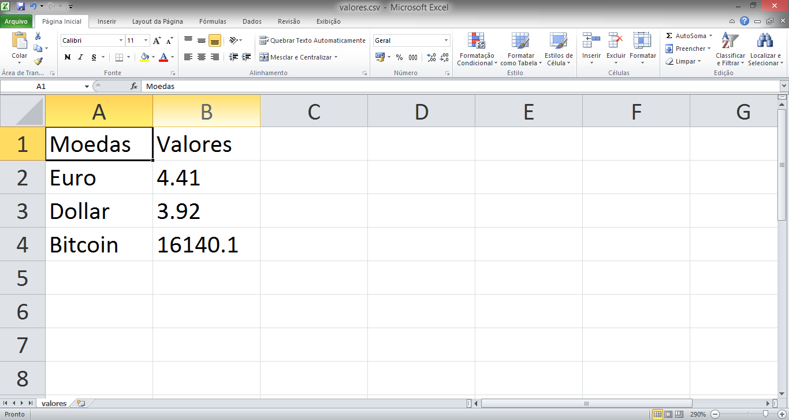

# Cambio com Python
Um script para pegar os valores, via requisição web, das cotações das principais moedas mundiais:
  - Dollar
  - Euro
  - Bitcoin

API utilizada: [FIXER.IO](https://fixer.io/)

### Bibliotecas para funcionamento do script
```sh
pip install requests
```
```sh
pip install json
```
```sh
pip install pandas
```

### Arquivo Gerado


### Desenvolvedor

 - Rodrigo Santana

License
----
**Free Software!** A documentação está atualmente armazenada [aqui](https://github.com/rssrodrigo/cambio-moedas)